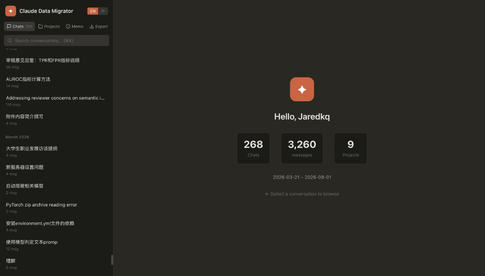
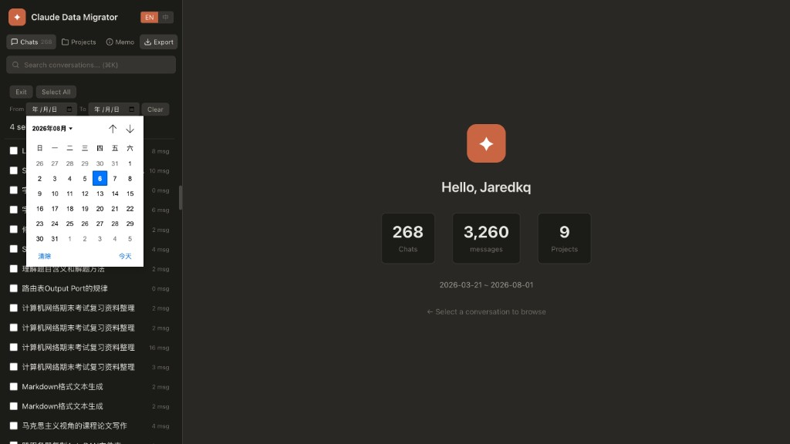

<h1 align="center">&nbsp;Claude Data Migrator</h1>

<p align="center">
  <strong>Never lose your Claude conversations again.</strong><br>
  Browse, search, tag, and export your Claude data — ready for migration to a new account.
</p>

<p align="center">
  <a href="README_zh.md">🇨🇳 中文文档</a> •
  <a href="#features">Features</a> •
  <a href="#quick-start">Quick Start</a> •
  <a href="#export-format">Export Format</a> •
  <a href="#license">License</a>
</p>

<p align="center">
  
  
  
  
</p>

<p align="center">
  
  
  
  
  
</p>

---

## Why?

**Claude accounts can get suspended.** When that happens, years of conversation history, project knowledge, and memories vanish overnight.

Worse still, even when you *can* export your data (Settings → Export Data), what you get is a brutal reality check:

- A giant flat `conversations.json` with thousands of messages crammed together
- Thinking blocks, tool calls, and tool results stored as raw nested JSON — barely human-readable
- No conversation-to-project mapping — Claude's export simply doesn't include which conversations belong to which project
- No UI, no search, no way to selectively pick what you need

You're left staring at megabytes of raw JSON, wondering which of your 200+ conversations actually matter.

**Claude Data Migrator** fixes all of this. It reconstructs the familiar Claude Web interface locally — same dark theme, same conversation layout, same thinking/tool blocks — so you can browse your data exactly like you did on claude.ai. Then you pick the conversations you need, and export them as clean, Claude-readable JSON files ready to upload as Project Knowledge to a new account.

Your data. Your backup. Your peace of mind. ☕

---

## Features

🎨 **Claude Web UI Restored** — Turns flat JSON dumps back into the familiar Claude interface: dark theme, message bubbles, thinking blocks, tool calls — exactly like browsing on claude.ai

🗂️ **Browse** — Navigate all conversations, projects, and memories with date grouping and message counts

🔍 **Search** — Full-text search across conversation titles and message content

🏷️ **Tag** — Claude's data export doesn't include conversation-to-project mappings, so this tool provides a manual tagging system to re-associate conversations with projects

📤 **Export** — Select conversations (individually, by project, by date range, or all at once) and export as JSON or Markdown, saved directly to local disk — no browser download, no macOS quarantine warnings

📋 **Copy** — Hover over any message, thinking block, or tool call to reveal a copy button (copies raw Markdown)

🌐 **Bilingual** — Full English / Chinese UI with one-click toggle

🔒 **100% Local** — All data stays on your machine. No uploads, no telemetry, no third-party servers

---

## Screenshots

<table>
  <tr>
    <td align="center" width="33%">
      <br>
      <sub><b>Browse</b> — Conversations with date grouping</sub>
    </td>
    <td align="center" width="33%">
      <br>
      <sub><b>Select</b> — Checkboxes, date range filter</sub>
    </td>
    <td align="center" width="33%">
      <br>
      <sub><b>Export</b> — Content mode, format & save path</sub>
    </td>
  </tr>
</table>

<details>
<summary>🖼️ Click to view full-size screenshots</summary>

<br>

**Browse conversations with date grouping and message counts**


**Select conversations with checkboxes, filter by date range**


**Choose content mode, file format, and save location**


</details>

---

## Quick Start

### 1. Get Your Claude Data

Go to [claude.ai](https://claude.ai) → **Settings** → **Account** → **Export Data**

You'll receive a ZIP file or a folder containing `conversations.json`, `memories.json`, and a `projects/` directory.

### 2. Install & Run

```bash
# Clone the repository
git clone https://github.com/kstanghere/claude-data-migrator.git
cd claude-data-migrator

# Install dependencies
pip install -r requirements.txt

# Run — point to your data (ZIP file or extracted folder)
python app.py /path/to/your/claude-data-export

# Or specify a custom port
python app.py --port 8080 /path/to/your/claude-data-export
```

Open [http://127.0.0.1:5000](http://127.0.0.1:5000) in your browser. That's it.

### 3. Export & Migrate

1. Click the **Export** tab
2. Select conversations (individually, by project, by date range, or "Select All")
3. Click **Export** → choose content mode and format → **Export**
4. File is saved directly to your Desktop (or custom path) — no browser download, no macOS quarantine warnings
5. Upload the exported JSON as **Project Knowledge** in your new Claude account

---

## Export Format

### JSON Structure

Exported JSON files follow a clean, human-readable structure that Claude can understand as Project Knowledge:

```json
{
  "export_info": {
    "source": "Claude Data Migrator",
    "exported_at": "2026-08-06T05:30:00+00:00",
    "mode": "full",
    "conversation_count": 5,
    "description": "My AI research conversations"
  },
  "conversations": [
    {
      "title": "Conversation Title",
      "date": "2026-07-15",
      "summary": "",
      "messages": [
        {
          "role": "user",
          "content": [
            { "type": "text", "text": "Hello, can you help me with..." }
          ]
        },
        {
          "role": "assistant",
          "content": [
            { "type": "text", "text": "Of course! Here's how..." }
          ]
        }
      ]
    }
  ]
}
```

### Content Modes

| Mode | Description | Use Case |
|------|-------------|----------|
| **Compact** | Text-only content blocks | Smaller files, ideal for Project Knowledge upload |
| **Full** | All content blocks (text, thinking, tool_use, tool_result) | Complete backup with full context |

### File Size Guidelines

Claude Project Knowledge has upload limits. The export dialog shows real-time size estimates:

- 🟢 **< 10 MB** — Good to go
- 🟡 **10–30 MB** — Consider splitting into smaller exports
- 🔴 **> 30 MB** — Exceeds limit, split or use Compact mode

---

## Project Structure

```
claude-data-migrator/
├── app.py              # Flask backend (API + static serving)
├── requirements.txt    # Python dependencies
├── templates/
│   └── index.html      # Single-page HTML shell
├── static/
│   ├── app.js          # Frontend logic (i18n, rendering, export)
│   └── style.css       # Dark-themed styles
└── docs/
    ├── logo.png
    └── screenshots...
```

---

## Tag System

Since Claude's data export doesn't include conversation-to-project mappings, this tool provides a **manual tagging system**:

1. Open any conversation
2. Click **"Tag Project"** in the header
3. Select one or more projects to associate with
4. Tags are saved to `_migrator_tags.json` in your data directory
5. Click a project in the Projects tab to see all tagged conversations

---

## Contributing

Contributions are welcome! Whether it's a bug fix, a new feature, or just a typo — feel free to open an issue or submit a PR.

```bash
# Fork & clone
git clone https://github.com/kstanghere/claude-data-migrator.git
cd claude-data-migrator

# Create a branch
git checkout -b feat/your-feature

# Make changes, then submit a PR
```

Some ideas for contribution:

- 🌍 Add more language translations
- 📊 Conversation analytics / statistics dashboard
- 🔄 Auto-detect conversation-to-project mappings
- 🎨 Light theme support
- 📱 Responsive mobile layout

---

## License

[MIT](LICENSE) — do whatever you want with it.

---

<p align="center">
  <em>Built with ❤️ for everyone who's ever lost a Claude account.<br>
  Export early, export often.</em>
</p>
